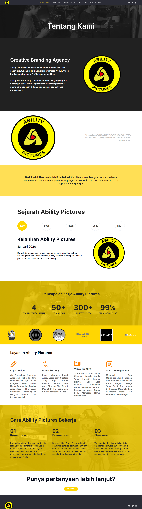
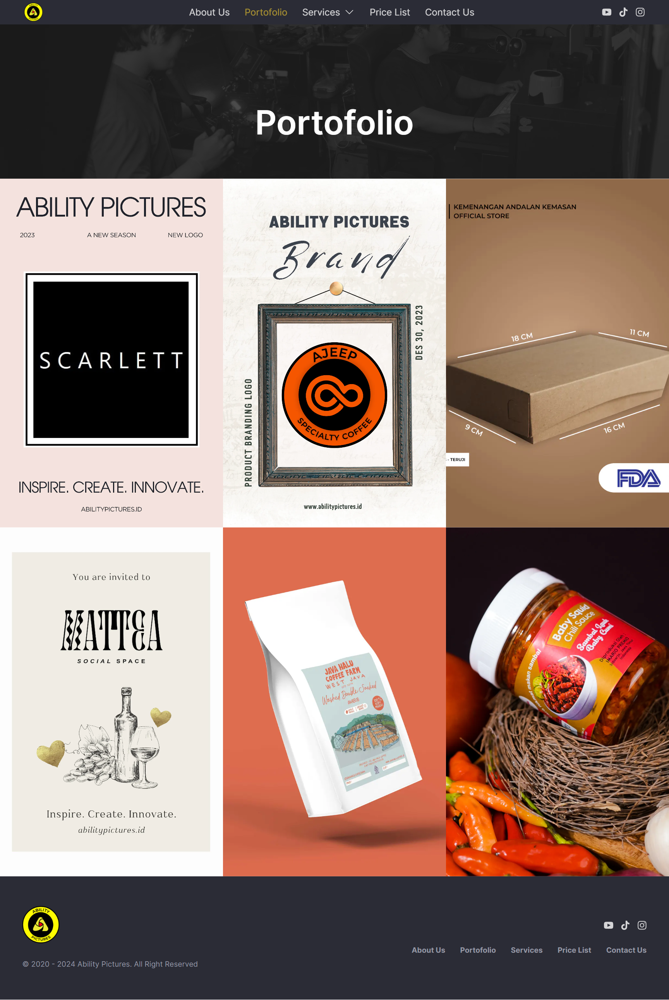
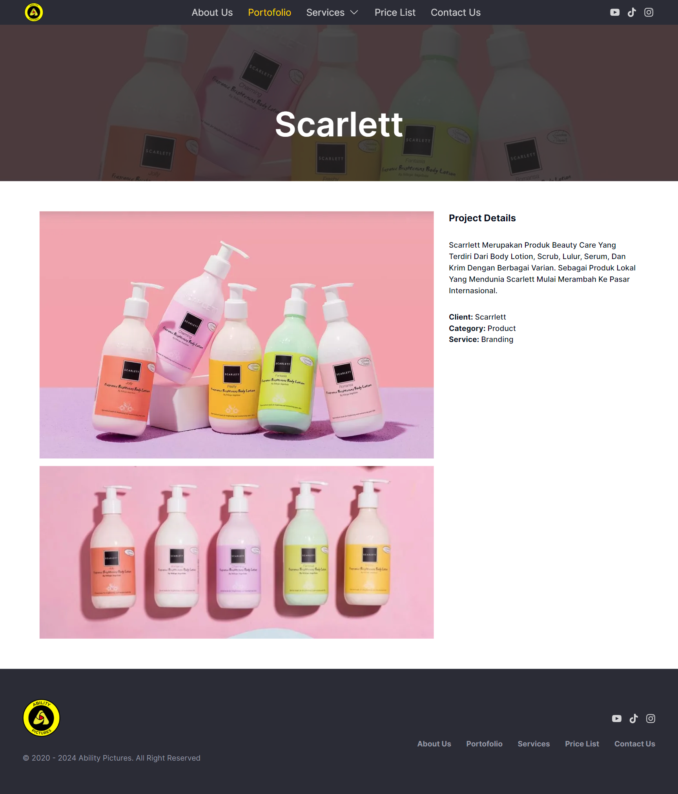
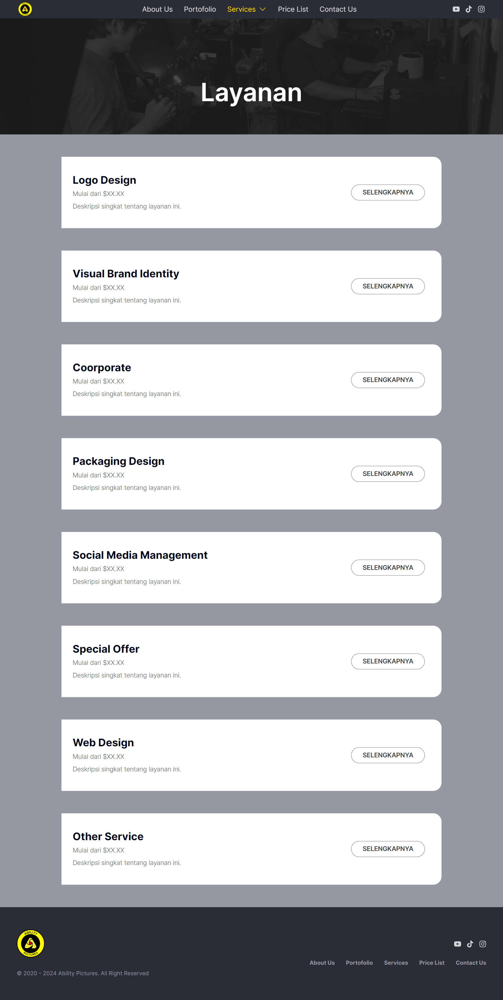
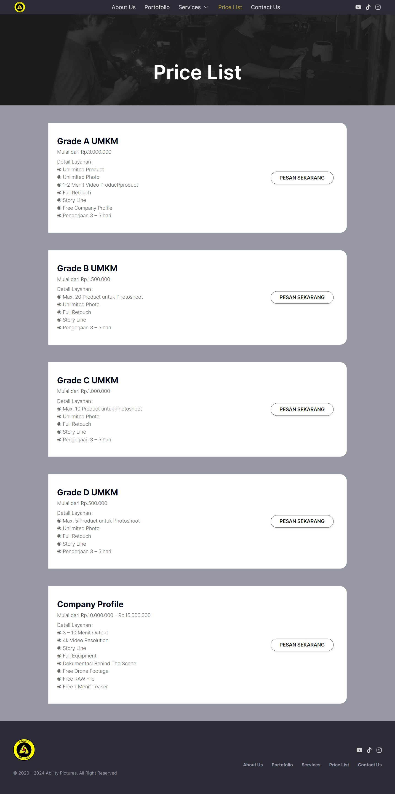
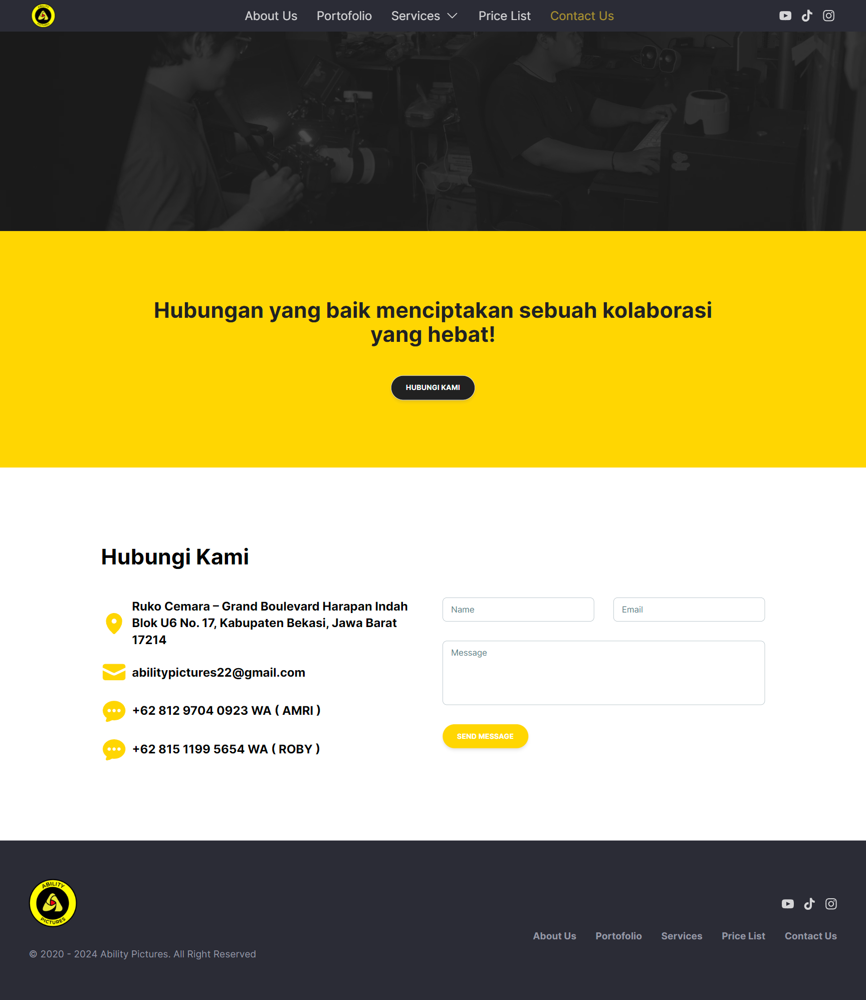

# Ability Pictures
## URL Website
- <a href="https://abilitypictures.id/" target="_blank" rel="noopener noreferrer nofollow">Link Publish</a>
- <a href="https://ability-pictures-hnd2qshxm.vercel.app/" target="_blank" rel="noopener noreferrer nofollow">Link Demo</a>

## Description
This is Website uses React JS for Developer Technical Test in Implementation Test - Frontend at Next JS.

## Technologies
### Frontend
- React JS or Next JS
- HTML
- CSS or Tailwind
- JavaScript
### Backend
- None

### Database or Data
- Local Storage
- No connection to Database!

## Folder Structure
- public
  - images
- src
    - app
        - about
            - layout.tsx
            - page.tsx
        - contact-us
            - layout.tsx
            - page.tsx
        - portofolio
            - [detail]
                - layout.tsx
                - page.tsx
            - ajeep
                - layout.tsx
                - page.tsx
            - java-halu-coffe
                - layout.tsx
                - page.tsx
            - kemengan-andalan-kemasan
                - layout.tsx
                - page.tsx
            - mattea
                - layout.tsx
                - page.tsx
            - sambal-bali
                - layout.tsx
                - page.tsx
            - scarlett
                - layout.tsx
                - page.tsx
            - layout.tsx
            - page.tsx
        - price-list
            - layout.tsx
            - page.tsx
        - services
            - [detail]
                - layout.tsx
                - page.tsx
            - logo-design
                - layout.tsx
                - page.tsx
            - visual-design
                - layout.tsx
                - page.tsx
            - web-design
                - layout.tsx
                - page.tsx
            - layout.tsx
            - page.tsx
        - favicon.ico
        - global.css
        - layout.tsx
        - page.tsx
    - components
        - about
            - hero.tsx
        - contact
            - button.tsx
            - hero.tsx
        - home
            - hero.tsx
        - portofolio
            - hero.tsx
        - price-list
            - hero.tsx
        - service
            - hero.tsx
        - ui
            - button.tsx
            - navigation-menu.tsx
            - sheet.tsx
        - about.tsx
        - achievement.tsx
        - footer.tsx
        - how-to.tsx
        - logo-marquee.tsx
        - navbar.tsx
        - portofolio.tsx
        - product_card.tsx
        - progress-bar.tsx
        - review.tsx
        - service.tsx
        - sidebar.tsx
        - vendor.tsx
    - data
        - navbar_props.tsx
    - lib
        - utils.ts
- next.config.mjs
- package.json
- server.js

## Demo *(in development)*
<b>Please wait.</b>

<details>
	<summary>Home Page</summary>
	

</details>

<details>
	<summary>About Page</summary>
	

</details>

<details>
	<summary>Portofolio Page</summary>
	

</details>

<details>
	<summary>Portofolio Detail Page</summary>
	

</details>

<details>
	<summary>Portofolio Detail Page</summary>
	

</details>

<details>
	<summary>Services Page</summary>
	

</details>

<details>
	<summary>Price List Page</summary>
	

</details>

<details>
	<summary>Contact Page</summary>
	

</details>

## Installation
### Clone Repo

```bash
git clone https://github.com/GrahadiM/Ability-Pictures.git
```
### Go to folder

```bash
cd bakarin-boss
```
### Install and build App with npm

```bash
npm install
```
and
```bash
npm run dev
```
or
```bash
npm run build
```
### Run App

```bash
npm run start
```